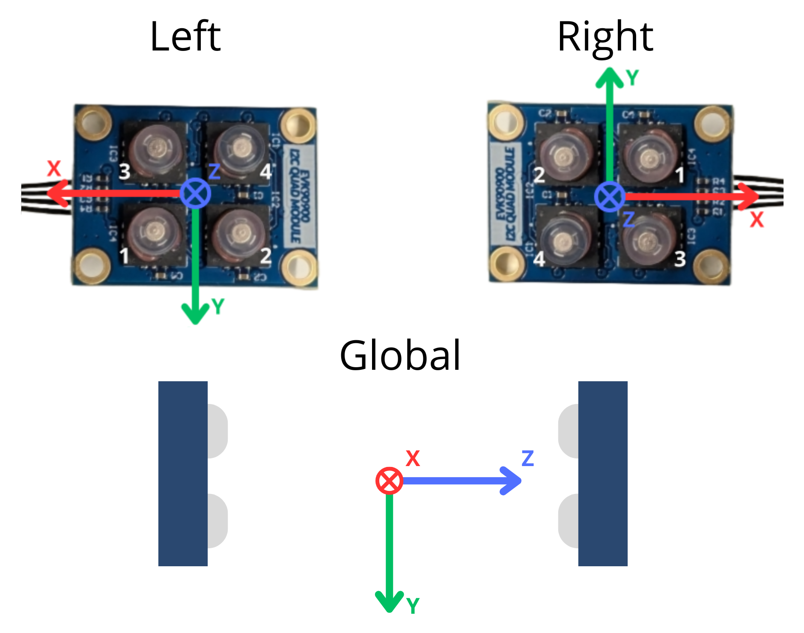
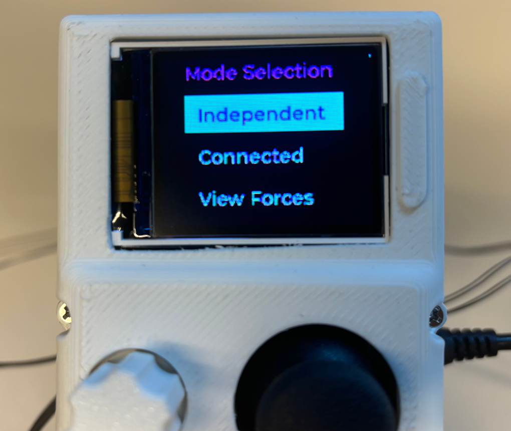
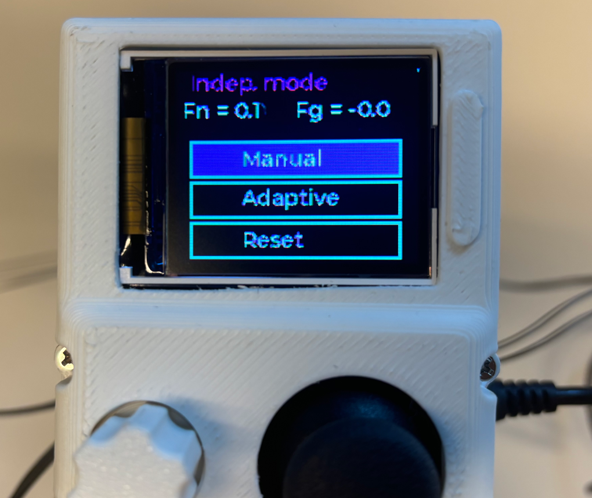
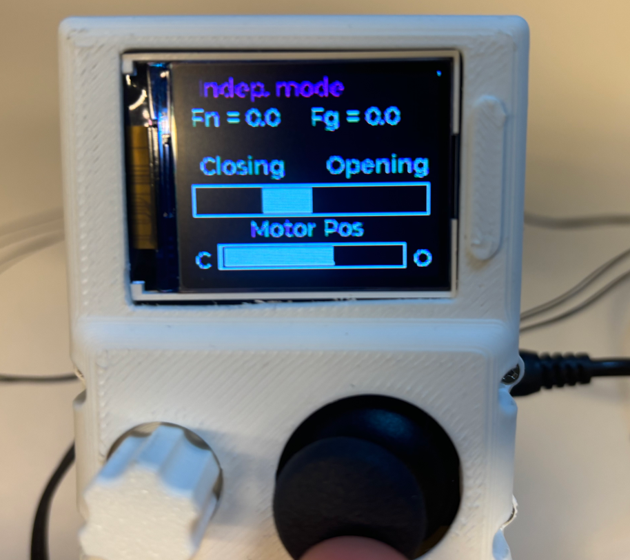
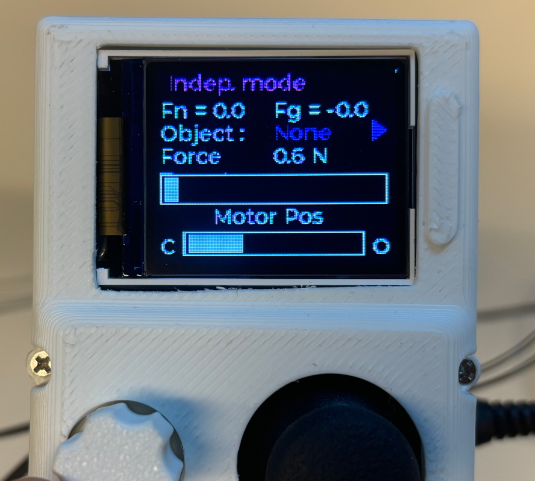
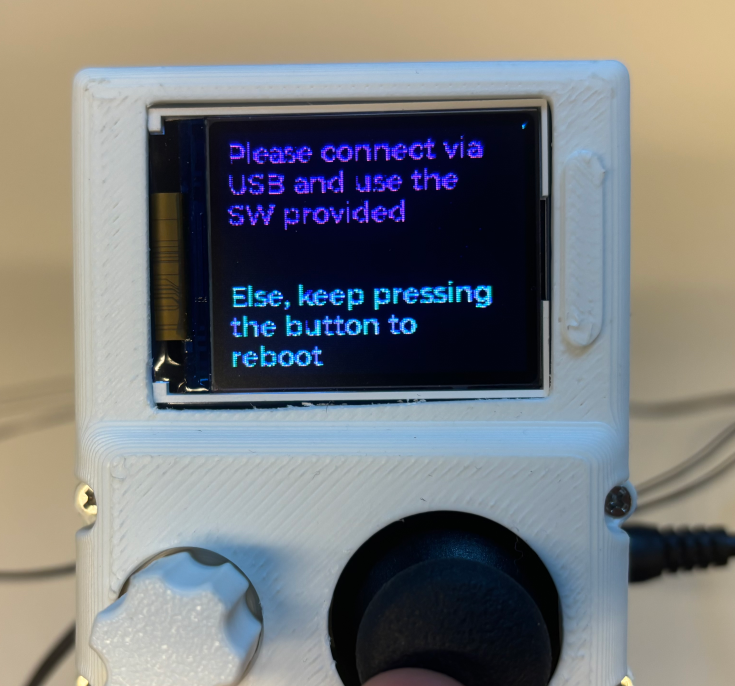
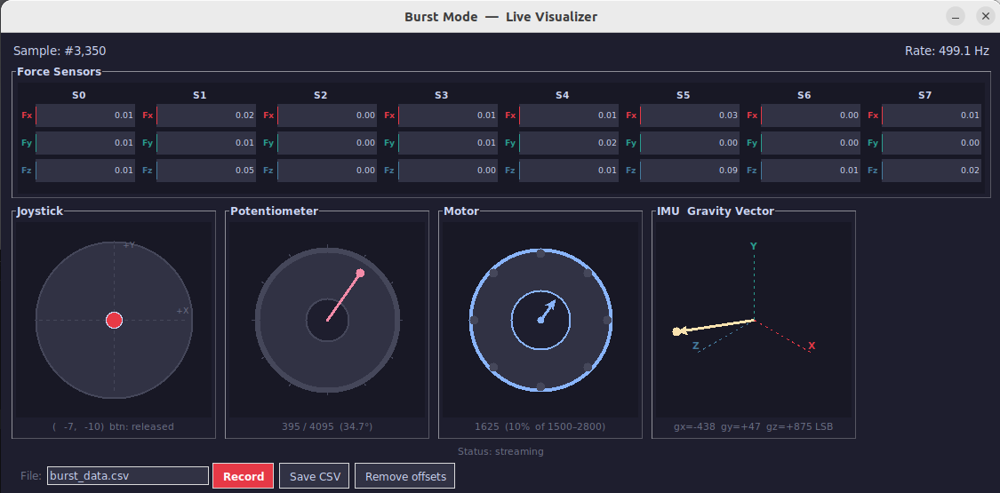
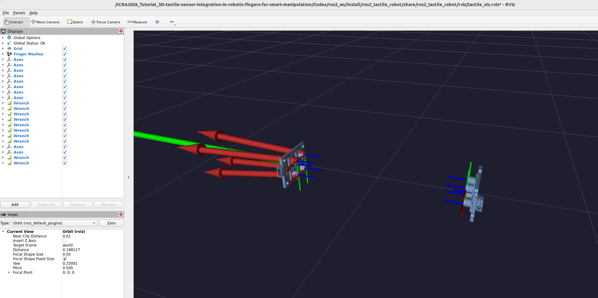
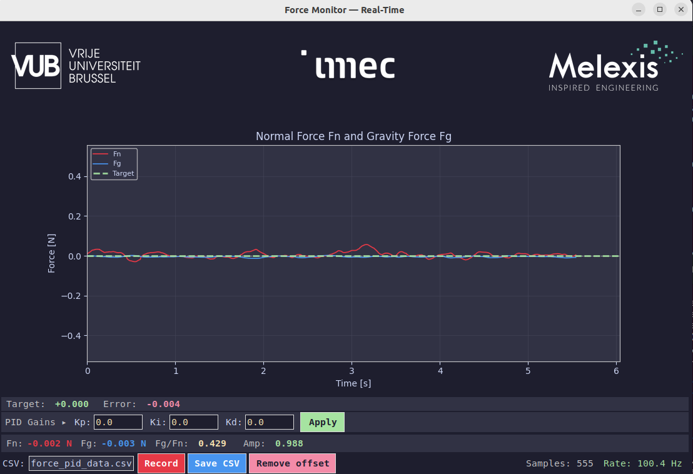
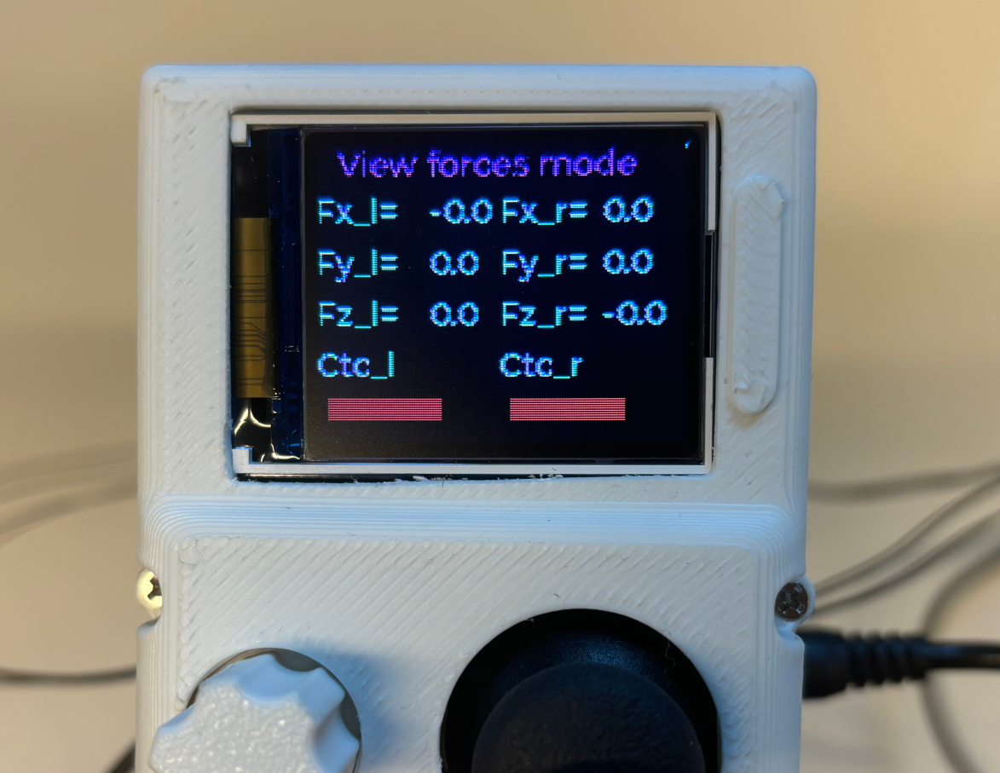

# 🤖 Codes

This folder contains all the software for the tutorial: a ROS 2 package (`ros2_tactile_robot`) and standalone Python scripts. The ROS 2 stack runs on **ROS 2 Humble**, either through the Pixi environment or inside the provided Docker container; the Python-only scripts can also be run directly on the host.

> 📌 Install your environment first — see [Step 3 of the main README](../README.md#step-3--install-your-software-environment) (Pixi, Docker or manual install).

---

## 📁 Repository Structure

```
Codes/
├── record_data/                     # CSV files saved by the GUI tools
├── python_codes/
│   ├── BurstMode.py                 # Standalone live GUI: force bars, joystick, pot, IMU + CSV recording
│   ├── Motor_initialisation.py      # Standalone script to initialise motor position before attaching it to the gripper
│   ├── simple_connected_mode.py     # Minimal connected-mode example (no GUI)
│   ├── SerialLibrary/               # Low-level ESP32 serial communication library
│   └── flash/                       # Firmware flashing utility (esptool-based)
│       └── flash.py
└── ros2_ws/
    └── src/
        └── ros2_tactile_robot/
            ├── launch/
            │   ├── full_system.launch.py       # All nodes: sensor, motor, GUI, joystick, pot, RViz
            │   └── pid_force_control.launch.py # PID force control + real-time force plot
            ├── meshes/                         # STL files for RViz finger visualisation
            ├── rviz/
            │   └── tactile_viz.rviz            # Pre-configured RViz scene
            └── ros2_tactile_robot/
                ├── esp_bridge_node.py          # ESP32 hardware interface (serial ↔ ROS 2 topics + RViz wrenches)
                ├── sensor_node.py              # Force magnitude & contact detection
                ├── motor_node.py               # Motor command arbitration
                ├── pid_control_node.py         # Adaptive PID force controller
                ├── joystick_node.py            # Joystick → velocity / motor commands
                ├── potentiometer_node.py       # Potentiometer → motor position setpoint
                ├── lcd_node.py                 # LCD display driver
                ├── gui_node.py                 # Desktop GUI: live force bars, joystick, pot, IMU + CSV recording
                ├── pid_gui_node.py             # Real-time Fg and Fn plot to do PID force control + CSV export
                └── tactile_finger_gui_node.py  # Per-finger tactile map + torque visualisation
```

---

## Forces sensors frame

The following frame has been considered in the codes for touch sensing:

<p align="center"></p>

F_g represents the gravitational force component along the gravity vector, as measured by the onboard IMU. F_n is the total normal force exerted on the object; since the two sensors apply equal force through each finger, the sum F_z should ideally be 0 N.


## 🚀 Before starting 
### 🔥 Flash the Firmware 

If the ESP32 has not been flashed yet, run the flashing script (requires `esptool`).

To run it with Pixi:
```bash
pixi run flash
```
To run it with Docker or with native installation:
```bash
cd /ICRA2026_Tutorial_3D-tactile-sensor-integration-in-robotic-fingers-for-smart-manipulation/Codes/python_codes/flash

#To launch the code
python3 flash.py
```

### ⚙️ Motor Initialisation
> Make sure the gripper LCD is set to **Connected** mode before running this command (see below)

Run this script first to confirm the serial link is working and bring the motor to its reference position before attaching it to the gripper.


To run it with Pixi:
```bash
pixi run motor
```


To run it with Docker or with native installation:
```bash
cd /ICRA2026_Tutorial_3D-tactile-sensor-integration-in-robotic-fingers-for-smart-manipulation/Codes/python_codes

#To launch the code
python3 Motor_initialisation.py
```

> With Pixi, the optional arguments below are passed after `--`, e.g. `pixi run motor -- -p /dev/ttyUSB0`.

Optional arguments:

| Flag | Default | Description |
|---|---|---|
| `-p`, `--com-port` | auto-detect | Serial port of the ESP32 (e.g. `/dev/ttyUSB0`) |
| `-s`, `--speed` | `250` | Motor speed |
| `-a`, `--acc` | `250` | Motor acceleration |
| `-f`, `--burst-frequency` | `200` | Sensor burst frequency in Hz |
| `-g`, `--debug` | off | Print raw serial frames for debugging |


## 🕹️ Gripper Operating Modes

Once the LCD on the gripper is on, the joystick can be used to navigate between modes. From the initial menu, pressing the joystick like a button opens the mode selection menu. The gripper firmware exposes three top-level modes, selectable from the on-board LCD menu: independent, connected and view forces mode.

<p align="center"></p>

### 1. 🔓 Independent Mode

Requires only the power supply, no USB-C cable to the computer is needed. You will be able to control the gripper thanks to the external PCB, the potentiometer and the joystick. Three sub-options are available:

| Sub-mode | Description |
|---|---|
| **Manual** | Control motor position directly with the joystick. Live normal force Fn and gravity force Fg readings are shown on the LCD. |
| **Adaptive** | Control the target grasp force with the potentiometer. A PD controller tracks the force setpoint; Kp and Kd gains change automatically depending on the selected object type (fragile plastic cup, deformable sponge, rigid wood cube). Use the joystick to switch between objects moving it left or right. |
| **Reset** | Return to the main menu. |

<p align="center"></p>

In **Manual** mode, the joystick controls the gripper position while live Fn and Fg readings from the force sensors are displayed on the LCD.

<p align="center"></p>

In **Adaptive** mode, the potentiometer sets the target grasp force. The PD controller adjusts the motor position to maintain that force, with gains tuned automatically based on the object selected with the joystick moving it left or right.

<p align="center"></p>

### 2. 🔌 Connected Mode

The gripper waits for commands from the computer via USB-C serial. **Select this mode on the LCD before launching any ROS 2 node or Python script. This screen must be visible before any commands or code can be launched from the computer.** After some time, the screen may automatically return to the initial menu. If this happens, you need to navigate back to this screen before relaunching another code.

<p align="center"></p>

#### 🛠️ Setup

##### 🔗 Plug in the USB-C cable

**Before starting the Docker container**, connect the USB-C cable from the gripper to your computer. The container maps serial devices at startup. If the cable is plugged in afterwards, the device will not be visible inside the container.

Verify that the host detects the device:

```bash
ls /dev/ttyACM* /dev/ttyUSB*
```

Expected output (the exact device name may vary):

```
/dev/ttyACM0
```

If you see `No such file or directory` for both, the cable is not connected or the driver is not loaded. Do not proceed until the device appears.


---

#### 📡 Launching Scripts

> ⚠️ Make sure the gripper LCD is set to **Connected** mode before running any of the commands below. The "Connected" mode screen must be visible before any commands or code can be launched from the computer. The Python code also works on Windows, you just need to change the / in the command for \ (backslash).

#### Python only

##### 🖥️ Simple Connected Mode (terminal, no GUI)

`simple_connected_mode.py` is the minimal starting point for working with the gripper from Python. It streams force data in burst mode and prints a live table to the terminal (no GUI, no ROS 2). It also includes a basic motor-follows-potentiometer example showing how to send commands back to the ESP32.

To run it with Pixi:
```bash
pixi run connected
```

To run it with Docker or with native installation:
```bash
cd /ICRA2026_Tutorial_3D-tactile-sensor-integration-in-robotic-fingers-for-smart-manipulation/Codes/python_codes

python3 simple_connected_mode.py

#To launch on Windows, it would be:
#cd \ICRA2026_Tutorial_3D-tactile-sensor-integration-in-robotic-fingers-for-smart-manipulation\Codes\python_codes
#python simple_connected_mode.py
```

Optional arguments:

| Flag | Default | Description |
|---|---|---|
| `-p`, `--com-port` | auto-detect | Serial port of the ESP32 |

The terminal output updates at ~50 Hz and shows:

```
Sample #   42 host=000.040
       S0      S1      S2      S3      S4      S5      S6      S7
Fx |  +00.12  -00.03  ...
Fy |  +00.05  +00.01  ...
Fz |  -01.24  -00.87  ...
G  | X=+00012 Y=-00034 Z=+00981 LSB
P  | joy=(  +12,   -5) btn=0  pot= 2048  motor=  2050
```

Press **Ctrl+C** to stop, the serial connection and background threads are closed automatically.

---

##### 📊 Python-Only Live GUI (no ROS 2)

`BurstMode.py` opens a standalone GUI with real-time force bars, joystick, potentiometer, motor and IMU visualisation, and CSV recording. It connects directly to the ESP32 over serial (no ROS 2 code).

To run it with Pixi:
```bash
pixi run burst-gui
```

To run it with Docker or with native installation:
```bash
cd /ICRA2026_Tutorial_3D-tactile-sensor-integration-in-robotic-fingers-for-smart-manipulation/Codes/python_codes

python3 BurstMode.py

#To launch on Windows, it would be:
#cd \ICRA2026_Tutorial_3D-tactile-sensor-integration-in-robotic-fingers-for-smart-manipulation\Codes\python_codes
#python BurstMode.py
```
You should see something like this appears:

<p align="center"></p>

It is possible to visualise all the data, and control the position of the fingers thanks to the potentiometer, with a position controller. It is also possible to remove the current offset with the button "Remove offset", and save the data.

Optional arguments:

| Flag | Default | Description |
|---|---|---|
| `-p`, `--com-port` | auto-detect | Serial port of the ESP32 |
| `--shear-scale` | `2.0` | Shear force Fx/Fy at full bar deflection, in each direction |
| `--normal-scale` | `5.0` | Normal force Fz at full bar deflection, in each direction |
| `--poll-ms` | `50` | GUI refresh interval in milliseconds |
| `--no-motor-pot` | off | Disable automatic motor follow from potentiometer |

CSV files are saved to `Codes/record_data/`.

---
#### ROS2 codes

##### 🔨 Build the ROS 2 workspace

You need to run this process every time you change the ROS2 code for the changes to take effect.

To run it with Pixi:
```bash
pixi run build
```

To run it with Docker inside the container or with native installation:

```bash
cd /ICRA2026_Tutorial_3D-tactile-sensor-integration-in-robotic-fingers-for-smart-manipulation/Codes/ros2_ws

colcon build
source install/setup.bash
```

##### 🖐️ Tactile Finger Visualisation (ROS 2)

Displays a live per-finger tactile map for the two-finger gripper. Run the ESP32 bridge first, then launch this node standalone.

To run it with Pixi:
```bash
#Starts both nodes in one terminal (Ctrl+C stops both)
pixi run tactile-viz
```

To run it with Docker inside the container or with native installation:
```bash
#On one terminal
ros2 run ros2_tactile_robot esp_bridge_node 

#Then on another terminal, go to the docker image with docker exec -it docker3dsensors bash
#Then go to ROS2 folder, build and source
ros2 run ros2_tactile_robot tactile_finger_gui_node
```

You should see something like the window below, showing the forces on each taxel and the total moment Mz for each finger:

<p align="center">
  
</p>

**Sensor dot encoding** — each dot represents one taxel:

| Visual property | Sensor signal |
|---|---|
| Dot **size** | Normal force Fz — larger = more contact |
| Dot **colour** | Fz magnitude — orange (light force) → red (heavy force) |
| Dot **X displacement** | Lateral shear Fx |
| Dot **Y displacement** | Lateral shear Fy |

The bottom status bar displays the summed Fx, Fy, Fz and Mz for each finger in real time.

**Button:** `Remove offsets` — captures the current readings as a zero baseline (tare). Press it before any measurement to remove drift or gravity offsets.

**Potentiometer:** the gripper can also be opened and closed directly from this view, turning the potentiometer drives the motor, exactly as in the burst-mode GUI. The full potentiometer sweep (0–4095) is mapped onto the safe travel range, so the whole turn is usable and the commanded position never leaves that range.

| Parameter | Default | Description |
|---|---|---|
| `motor_follows_pot` | `true` | Set to `false` to decouple the potentiometer from the motor |

```bash
ros2 run ros2_tactile_robot tactile_finger_gui_node --ros-args -p motor_follows_pot:=false
```

---

##### 🚀 Full System Launch (ROS 2)

Starts all nodes: ESP32 bridge, sensor processing, motor control, joystick, potentiometer, LCD, desktop GUI, and RViz. Like the Burst mode with Python, you will be able to visualise every component's data, save the data in a CSV file and control the gripper with the joystick. You will also have a visualisation in RViz of the force cylinder on each taxel:

<p align="center"></p>

<p align="center">
  
</p>

**How it works:** `esp_bridge_node` connects to the ESP32 over serial, streams raw force vectors on `/esp/force`, and publishes the TF frames and mesh markers for RViz. The `gui_node` subscribes to `/esp/force`, applies the tare offset, and publishes tared per-finger and total wrenches (`/tactile/wrench/*`) that drive the force cylinders in RViz. It also renders the live GUI with force bars and CSV recording. The `sensor_node` runs contact detection; `motor_node` arbitrates motor commands from the joystick, potentiometer, and GUI; `joystick_node` and `potentiometer_node` translate peripheral inputs into velocity and motor setpoints; and `lcd_node` updates the on-board display.

To launch the code, don't forget to build and run this:
```bash
#for Pixi, from the repository root
pixi run launch-all

#With Docker / native, once the workspace is built and sourced
ros2 launch ros2_tactile_robot full_system.launch.py
```

Optional arguments (use `pixi shell` first if you are on Pixi, then the plain `ros2 launch` command):

| Argument | Default | Description |
|---|---|---|
| `com_port` | auto-detect | Serial port of the ESP32 |
| `gui` | `true` | Set to `false` to disable the desktop GUI |
| `motor_follows_pot` | `true` | Set to `false` to decouple the potentiometer from the motor |
| `rviz` | `true` | Set to `false` to skip RViz |

Example, with explicit port:

```bash
ros2 launch ros2_tactile_robot full_system.launch.py com_port:=/dev/ttyUSB0 gui:=false rviz:=false
```

---

##### 🎛️ PID Force Control Launch (ROS 2)

Starts the adaptive force controller together with a real-time **Fn / Fg** plot. The potentiometer sets the target normal force (0–5 N).

The controller uses the following structure:
- **Exponential low-pass filter on `fn` and `fg`** (`alpha` parameter): smooths sensor noise before the error is computed. A higher `alpha` gives faster response but more noise; a lower value gives smoother output but slower tracking.
- **Asymmetric deadband**: no motor command is sent when `|error| ≤ deadband_n`. This prevents the motor from hunting around the setpoint when the force is already close to the target.
- **Minimum target guard**: the controller is fully inhibited when the target force is below 0.1 N (integral and derivative reset, and the gripper actively opens to release any residual contact force). This prevents the gripper from holding a leftover force when the potentiometer is at zero.
- **Startup auto-zero**: The GUI **Remove offset** button re-publishes on `/pid/tare` at any moment; open the gripper, press the button to re-zero both the PID controller and the GUI plot/offsets.

The gains (Kp, Ki, Kd), the `alpha` and `deadband_n` parameters should be chosen based on the object being grasped. A reference table is provided below: stiffer objects tolerate lower gains, while softer or more delicate objects benefit from higher gains and tighter deadbands to track the target force more precisely.

The GUI displays four live values:
- **Fn**: total normal force on the object applied by the 2 fingers.
- **Fg** : component of the total contact force aligned with gravity thanks to IMU data.
- **Fg/Fn** ratio — grasp-stability indicator:
  - **Too low**: the grip is not tight enough and slippage may occur.
  - **Too high**: excessive force is being applied, which can damage fragile objects.
- **Amp** : peak-to-peak amplitude of the Fg/Fn ratio over a rolling window of x samples. Spikes during slip events / vibrations and is a useful micro-slip indicator.

```bash
#With Pixi, from the repository root
pixi run pid

#With Docker / native, once the workspace is built and sourced
ros2 launch ros2_tactile_robot pid_force_control.launch.py
```

You should see something like this:
<p align="center"></p>

<p align="center">
  
</p>

Optional arguments (use `pixi shell` first if you are on Pixi, then the plain `ros2 launch` command):

| Argument | Default | Description |
|---|---|---|
| `com_port` | auto-detect | Serial port of the ESP32 |
| `kp` | `0.0` | Proportional gain |
| `ki` | `0.0` | Integral gain |
| `kd` | `0.0` | Derivative gain |
| `alpha` | `0.75` | LPF weight applied to `fn` and `fg` (0 = frozen, 1 = raw) |
| `deadband_n` | `0.15` | Error deadband in N — no motor command within this band |
| `window_s` | `20.0` | Rolling time window of the force plot in seconds |

**Reference gain values (per object type; they can be found in the BOM for test):**

| Object | Kp | Kd | alpha | deadband |
|---|---|---|---|---|
| CUBE   | 11 | 25 | 0.70 | 0.20 N |
| SPONGE | 20 | 28 | 0.75 | 0.15 N |
| CUP    | 28 | 35 | 0.80 | 0.10 N |

---


### 3. 👁️ View Forces

Displays live Fx, Fy, Fz readings and contact detection for both fingers on the LCD. Press the joystick to return to the main menu.

<p align="center"></p>

---

## 💾 CSV Recording Format

All three GUIs (`BurstMode.py`, `gui_node.py`, `pid_gui_node.py`) save recordings to `Codes/record_data/` with the same column layout, so the same post-processing scripts can be used across all tools. Each row is one sample, timestamped from the start of the recording. The columns are, in order:

| # | Column | Description |
|---|---|---|
| 1 | `time_s` | Time since record start in seconds |
| 2–25 | `Sensor{i}_Fnormal [N]`, `Sensor{i}_Fshear_X [N]`, `Sensor{i}_Fshear_Y [N]` (i = 1…8) | Tared per-taxel normal (Fz) and shear (Fx, Fy) forces — 3 columns per sensor × 8 sensors |
| 26–31 | `Left finger - force/torque in x/y/z` | Sum of the 4 left-finger taxel forces and computed torque around each axis |
| 32–37 | `Right finger - force/torque in x/y/z` | Sum of the 4 right-finger taxel forces and computed torque around each axis |
| 38–43 | `Total tactaxis - force/torque in x/y/z` | Combined gripper wrench (firmware sign convention: `fx_tot=fx_L+fx_R`, `fy_tot=fy_L−fy_R`, `fz_tot=fz_L−fz_R`) |
| 44 | `Position gripper` | Motor encoder position (0–4095) |
| 45 | `Gravity force Fg [N]` | Component of the total contact force aligned with gravity |
| 46 | `Normal force Fn [N]` | Total normal grip force `= −(fz_L + fz_R)` |
| 47 | `Ratio Fg/Fn [-]` | Grasp-stability ratio — high `Fg/Fn` ≈ near slip, low ≈ over-gripping |
| 48 | `Target force [N]` | PID target derived from the potentiometer (only meaningful for `pid_gui_node`; empty otherwise) |
| 49 | `Fg/Fn ratio peak-to-peak amplitude  [-]` | Rolling-window peak-to-peak amplitude of the Fg/Fn ratio (window size can be chosen) — micro-slip / vibration indicator |


---

## 📶 ROS 2 Topics (quick reference)

Don't hesitate to do the following command to see the list of topics when launching a code and see what each topic is publishing:

```bash
ros2 topic list

#Then, to see what is published
ros2 topic echo <name of the topic>
```

### Published by `esp_bridge_node`

| Topic | Type | Description |
|---|---|---|
| `/esp/force` | `std_msgs/Float32MultiArray` | 8 sensors × 3 floats (Fx, Fy, Fz); sensors 0–3 = left finger, 4–7 = right finger |
| `/esp/imu` | `sensor_msgs/Imu` | BNO055 gravity vector (linear_acceleration field, in m/s²) |
| `/esp/joystick` | `sensor_msgs/Joy` | Joystick axes [x, y] and button state |
| `/esp/potentiometer` | `std_msgs/Int32` | Raw potentiometer value (0–4095) |
| `/esp/motor_position` | `std_msgs/Int32` | Current motor position |
| `/esp/status` | `std_msgs/String` | JSON acquisition status from the ESP32 |
| `/tactile/wrench/left_finger` | `geometry_msgs/WrenchStamped` | Summed wrench for the left finger |
| `/tactile/wrench/right_finger` | `geometry_msgs/WrenchStamped` | Summed wrench for the right finger |
| `/tactile/wrench/total` | `geometry_msgs/WrenchStamped` | Total gripper wrench (Tactaxis convention) |
| `/tactile/wrench/left_0..3` | `geometry_msgs/WrenchStamped` | Per-sensor wrench, left finger (one topic per taxel) |
| `/tactile/wrench/right_0..3` | `geometry_msgs/WrenchStamped` | Per-sensor wrench, right finger (one topic per taxel) |
| `/tactile/markers` | `visualization_msgs/MarkerArray` | STL mesh markers for RViz |

### Subscribed by `esp_bridge_node`

| Topic | Type | Description |
|---|---|---|
| `/motor/drive` | `std_msgs/Float32MultiArray` | Motor command `[position, speed, acceleration]` |
