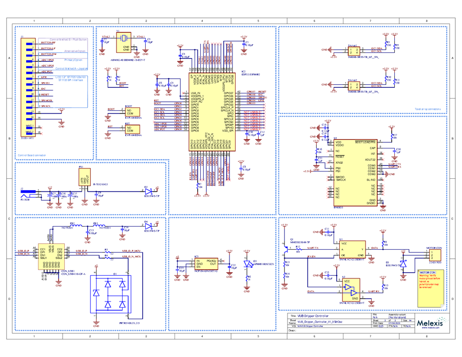
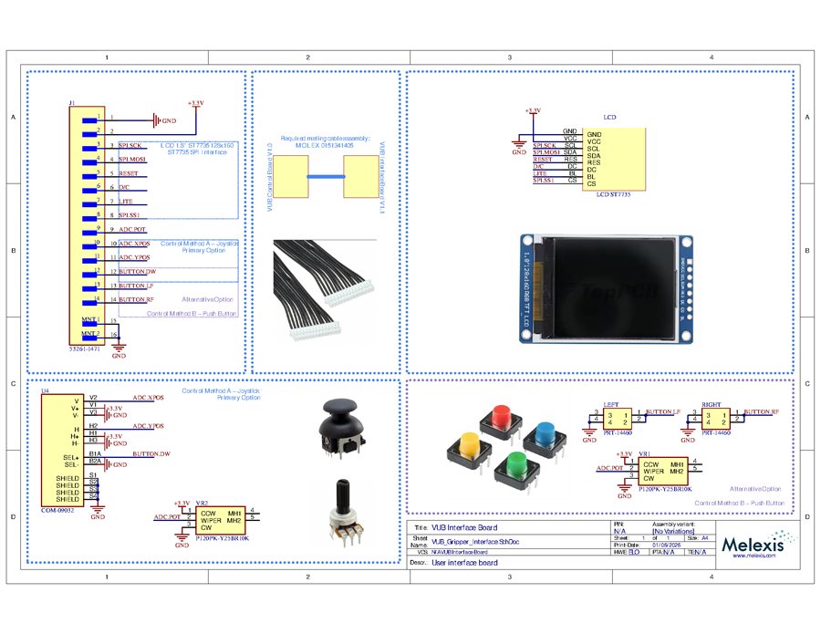

# Electronics folder
Folder containing circuit diagrams and electronics documentation.

# ⚡ Electronics & Firmware
Welcome to the electronics section of the Tactile Sensor Gripper ! This folder contains everything you need to build the electronic circuit, understand the high-level firmware, and flash the code to your ESP32.

## 📋 Table of Contents
- [⚡ Electronics \& Firmware](#-electronics--firmware)
  - [📋 Table of Contents](#-table-of-contents)
  - [🔬 Overview](#-overview)
  - [🛠️ Hardware](#️-hardware)
    - [Bill of Materials (BOM)](#bill-of-materials-bom)
    - [Schematics](#schematics)
  - [🧠 Firmware Architecture](#-firmware-architecture)
    - [Mode 0 — Independent](#mode-0--independent)
    - [Mode 1 — Connected](#mode-1--connected)
    - [Serial Frame Protocol](#serial-frame-protocol)
      - [Frame structure](#frame-structure)
      - [Commands (PC → ESP32)](#commands-pc--esp32)
      - [Response (ESP32 → PC)](#response-esp32--pc)
      - [Burst frame payload (`0x15`) — 124 bytes total](#burst-frame-payload-0x15--124-bytes-total)
    - [Mode 2 — View Forces](#mode-2--view-forces)
  - [💻 Flashing the ESP32](#-flashing-the-esp32)
    - [Prerequisites](#prerequisites)
    - [Step-by-Step Guide](#step-by-step-guide)

---

## 🔬 Overview
This section is powered by an ESP32 microcontroller, which handles the data acquisition from the tactile sensors, computes the 3d force and interfaces with the peripherals.

---

## 🛠️ Hardware
The electronics for this tutorial are split across two custom printed circuit boards.
- Gripper Controller: This is the main board. It hosts the ESP32 microcontroller, the core tactile sensors, and the motor driver required to operate the gripper.
- User Interface: This secondary board is designed for manual interaction. It hosts an LCD screen, a potentiometer, and a joystick, allowing users to control the gripper and visualize data directly without needing a computer.

### Schematics

| Gripper Controller | User Interface |
| :---: | :---: |
|  |  |
| 📄 [Open full PDF](./Schematics/Gripper_controller_PCB.pdf) | 📄 [Open full PDF](./Schematics/User_Interface_PCB.pdf) |

### Bill of Materials (BOM)

#### Gripper Controller

| Part number | Description | Designator | Qty |
| :--- | :--- | :--- | :---: |
| EVP-AWED4A | Switch | BOOT, RST | 2 |
| GCM155R71C104KA55D | CAP CER 0.1 µF 16 V X7R 0402 | C1, C4, C5, C6, C8, C10, C11, C15 | 8 |
| GCM1555C1H180JA16D | CAP CER 18 pF 50 V NP0 0402 | C2, C3 | 2 |
| EEEFK1C101P | Aluminum Electrolytic 100 µF 16 V 5.3×5.8 mm | C7, C16, C17 | 3 |
| GRJ155R60J106ME11D | CAP CER 10 µF 6.3 V X5R 0402 | C9, C14, C22, C23 | 4 |
| GCM188R71C105KA64D | CAP CER 1 µF 16 V X7R 0603 | C12, C20, C21 | 3 |
| GRM155R60J684KE19D | CAP CER 0.68 µF 6.3 V X5R 0402 | C13 | 1 |
| GRM188R61A124KA01D | CAP CER 0.12 µF 10 V X5R 0603 | C18, C19 | 2 |
| USB4110-GF-A | USB Type-C receptacle, SMD right-angle | CON_USB1 | 1 |
| PRTR5V0U2X,215 | TVS diode 5.5 V SOT143B | D1 | 1 |
| B5819WS-TP | Schottky diode 40 V 1 A SOD323 | D2, D4, D5 | 3 |
| APHHS1005CGCK | LED green clear chip SMD | D3 | 1 |
| 742792651 | Ferrite bead 600 Ω 0603 | FB2, FB3 | 2 |
| ESP32-S3FH4R2 | RF transceiver + MCU BLE 56-QFN | IC2 | 1 |
| NCP164ASN330T1G | LDO regulator 3.3 V 300 mA 5-TSOP | IC3 | 1 |
| 53261-1471 | Connector header SMD R/A 14-pos 1.25 mm | J1 | 1 |
| PJ-102B | DC power jack through-hole R/A 2.5 mm | J2 | 1 |
| 22-05-7035 | Connector header R/A 3-pos 2.5 mm Molex | MOTOR CON | 1 |
| R-78K5.0-0.5 | DC/DC converter 5 V 0.5 A | PS1 | 1 |
| MMSS8550-H-TP | Transistor PNP 25 V 1.5 A SOT-23 | Q1 | 1 |
| ERJ-2GEJ102X | RES SMD 1 kΩ 5% 1/10 W 0402 | R1, R2, R6 | 3 |
| ERJ-2RKF22R0X | RES SMD 22 Ω 1% 1/10 W 0402 | R3, R4 | 2 |
| ERJ-2RKF3300X | RES SMD 330 Ω 1% 1/10 W 0402 | R5, R9, R10, R11 | 4 |
| ERJ-2GEJ103X | RES SMD 10 kΩ 5% 1/10 W 0402 | R7, R8, R12–R17 | 8 |
| SM04B-SRSS-TB | Connector header SMD R/A 4-pos 1 mm | SArray1, SArray2 | 2 |
| SN74LVC1G126DBVT | Buffer non-inverting 5.5 V SOT23-5 | U1 | 1 |
| SN74LVC1G125DBVT | Buffer non-inverting 5.5 V SOT23-5 | U2 | 1 |
| BNO055 | IMU accel/gyro/mag I2C 28-LGA | U3 | 1 |
| ABM8G-40.000MHZ-18-D2Y-T | Crystal 40 MHz 18 pF SMD | Y1 | 1 |

#### User Interface

| Part number | Description | Designator | Qty |
| :--- | :--- | :--- | :---: |
| 53261-1471 | Connector header SMD R/A 14-pos 1.25 mm | J1 | 1 |
| LCD ST7735 | LCD 1.8″ ST7735 | LCD | 1 |
| PRT-14460 | Tactile switch | LEFT, RIGHT | 2 |
| COM-09032 | Thumb joystick | U4 | 1 |
| P120PK-Y25BR10K | Potentiometer 10 kΩ | VR1, VR2 | 2 |

---

## 🧠 Firmware Architecture

The ESP32-S3 firmware runs on **FreeRTOS** and is structured around a top-level **state machine**. On boot, the LCD displays a welcome screen — press the joystick button to reach the mode-selection menu, then tilt the joystick up/down to highlight a mode and press to confirm.

```text
Boot
 └─► Welcome screen  (press joystick to continue)
      └─► Mode Selection Menu
           ├─► [0] Independent  ──► Manual sub-mode  (joystick → motor position)
           │                    └─► Adaptive sub-mode (potentiometer → target force, on-board PD controller)
           ├─► [1] Connected    ──► Streams sensor data to PC over USB-C; accepts motor commands
           └─► [2] View Forces  ──► Live Fx/Fy/Fz display on LCD only
```

---

### Mode 0 — Independent

No computer required; the gripper operates fully standalone.

| Sub-mode | How to interact | What happens |
| :--- | :--- | :--- |
| **Manual** | Tilt joystick to open/close gripper | Motor position follows joystick; live Fx/Fy/Fz from both fingers shown on LCD |
| **Adaptive** | Turn potentiometer to set target force; tilt joystick to select object type | On-board PD controller adjusts motor to maintain the target grasp force; gains switch automatically for the selected object (cube / sponge / cup) |
| **Reset** | Press joystick | Returns to the main menu |

> **Tutorial use:** start here to verify the hardware is working and to get a feel for the force feedback before connecting to the computer.

---

### Mode 1 — Connected

The gripper waits for commands from the host PC over the USB-C serial link (CDC).

**What the firmware streams to the PC :**

| Data | refresh rate | Description |
| :--- | :--- | :--- |
| Force frames | up to ~500 Hz | 8 sensors × Fx, Fy, Fz (4 sensors per finger) |
| IMU | 20 Hz | BNO055 gravity vector (linear acceleration) |
| Joystick | 20 Hz | X/Y axes + button state |
| Potentiometer | 20 Hz | Raw ADC value (0–4095) |
| Motor position | 20 Hz | Current STS3215 servo position |

**What the firmware accepts from the PC:**

| Command | Effect |
| :--- | :--- |
| Motor drive | Sets motor position, speed, and acceleration |
| Start/stop burst | Enables or disables sensor streaming |
| Configure rates | Changes the streaming period for each data type |

> **Tutorial use:** select this mode before launching any Python script or ROS 2 node. The scripts will not receive data if the gripper is in a different mode.

---

### Serial Frame Protocol

All traffic between the PC and the ESP32 uses the same framing layer in both directions.

#### Frame structure

```text
┌──────────┬────────┬──────────┬──────────────────┬──────────┬────────┐
│ START    │ ID     │ LEN      │ PAYLOAD          │ CRC-8    │ END    │
│ 0x7E (1B)│ (1B)   │ (1B)     │ (LEN bytes)      │ (1B)     │ 0x7F   │
└──────────┴────────┴──────────┴──────────────────┴──────────┴────────┘
```

- **CRC-8** covers `[ID, LEN, PAYLOAD...]` (computed before byte stuffing).
- **Byte stuffing** — any occurrence of a special byte inside `[ID … CRC-8]` is replaced with an escape sequence:

| Original byte | Escaped sequence |
| :--- | :--- |
| `0x7E` (START) | `0x7D 0x5E` |
| `0x7F` (END) | `0x7D 0x5F` |
| `0x7D` (ESC) | `0x7D 0x5D` |

To decode: after receiving `0x7D`, XOR the next byte with `0x20` to recover the original value.

---

#### Commands (PC → ESP32)

| ID | Name | Payload |
| :--- | :--- | :--- |
| `0x14` | `STREAM_BURST` | 16-byte config — starts the high-rate burst stream |
| `0x1F` | `STREAM_STOP` | *(none)* — stops the active stream |
| `0x40` | `MOTOR_CONTROL` | `position` int16 + `speed` uint16 + `acc` uint8 (all LE) |

#### Response (ESP32 → PC)

| ID | Name | Payload |
| :--- | :--- | :--- |
| `0x15` | `STREAM_BURST` | see burst frame layout below |

---

#### Burst frame payload (`0x15`) — 124 bytes total

```text
Offset  Size  Type          Field
──────  ────  ────────────  ──────────────────────────────────────────────
  0     96    8 × {f32,     force[0..7].{Fx, Fy, Fz}  (Newton)
               f32, f32}    sensors 0–3 = left finger (I2C bus 0)
                             sensors 4–7 = right finger (I2C bus 1)
 96      2    int16 LE      gravity_x_lsb  (BNO055 raw LSB)
 98      2    int16 LE      gravity_y_lsb
100      2    int16 LE      gravity_z_lsb
102      2    uint16 LE     imu_success_count
104      2    uint16 LE     imu_fail_count
106      2    uint16 LE     force_success_count
108      2    uint16 LE     force_fail_count
110      2    int16 LE      imu_last_err  (ESP-IDF error code)
112      1    uint8         imu_last_read_ok  (1 = OK, 0 = fail)
113      1    uint8         force_last_read_ok
114      2    int16 LE      joystick_x
116      2    int16 LE      joystick_y
118      1    uint8         joystick_button  (1 = pressed)
119      1    uint8         _pad
120      2    int16 LE      potentiometer  (0–4095)
122      4    int32 LE      motor_position
```

---

### Mode 2 — View Forces

Displays live Fx, Fy, Fz and contact detection for both fingers directly on the LCD. No computer needed. Press the joystick button to return to the main menu.

---

## 💻 Flashing the ESP32

The pre-built firmware binaries are included in the repository under `Codes/python_codes/flash/bin/`. A small Python helper script handles the entire flashing process — no ESP-IDF installation required.

### Prerequisites

- Python 3.8 or later
- `esptool` Python package:

  ```bash
  pip install esptool
  ```

  > The script also searches for an existing ESP-IDF Python environment under `~/.espressif/` and will use it automatically if found.

- A USB-C cable connecting the ESP32-S3 to your computer (native USB port on the board, **not** the UART port if your board has both).

### Step-by-Step Guide

1. **Connect** the ESP32-S3 to your computer via USB-C and wait for the OS to enumerate the device.

   On Linux/macOS, verify the port appeared:

   ```bash
   ls /dev/ttyACM* /dev/ttyUSB*
   ```

   On Windows, check **Device Manager → Ports (COM & LPT)** for a new `COMx` entry.

2. **Navigate** to the flash directory:

   ```bash
   cd Codes/python_codes/flash
   ```

3. **Run** the flash script:

   ```bash
   python flash.py
   ```

   The script auto-detects the ESP32-S3 by USB VID/PID (`0x303A / 0x1001`). If more than one device is connected, or auto-detection fails, pass the port explicitly:

   ```bash
   # Linux / macOS
   python flash.py -p /dev/ttyACM0

   # Windows
   python flash.py -p COM9
   ```

   Optional arguments:

   | Flag | Default | Description |
   | :--- | :--- | :--- |
   | `-p`, `--port` | auto-detect | Serial port of the ESP32-S3 |
   | `--baud` | `460800` | Flash baud rate |

4. **Wait** for the script to finish. It flashes the bootloader, partition table, and main firmware, then hard-resets the board.

5. **Confirm** the board is running: the LCD should show the tutorial welcome screen within a few seconds of the reset.
