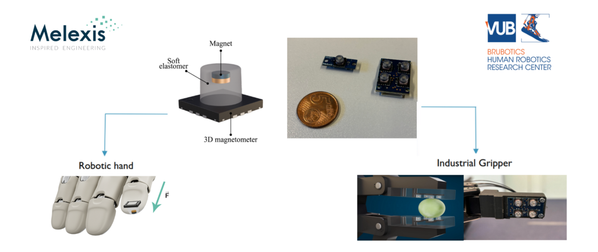
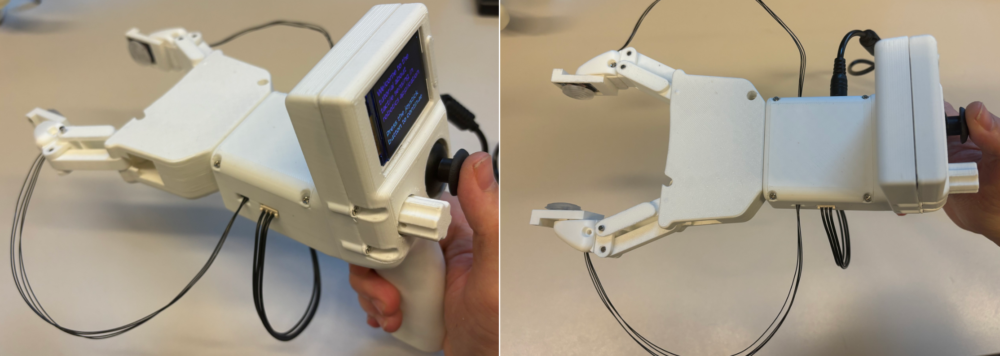

# 🤖 Hands-on Tutorial: 3D Tactile Sensor Integration in Robotic Fingers for Smart Manipulation

**Hands-on Tutorial presented at ICRA 2026**

**Organisers of the event:** Milan Amighi, Constantin Scholz, and Bram Vanderborght  
*(Brubotics – VUB & imec, in collaboration with Melexis)*

---

## 🧠 Overview

Despite skin being our largest sensory organ, touch remains underused in robotics. Tactile sensing is vital for safe and dexterous manipulation, human-robot interaction, and wearable devices, yet most robotic sensors measure only normal pressure. We live among materials with distinct rigidity, friction, weight, and texture, differences that humans intuitively perceive through touch. Robots can already move, see, and hear; the next frontier is enabling them to truly *feel*, so they can grasp delicate and deformable objects while accounting for each object's physical properties.

This hands-on tutorial introduces an affordable, compact, and robust 3D tactile sensor developed by Melexis: the **Tactaxis® 3D force sensor**, which uses automotive-grade Hall-effect technology to measure both normal and shear forces simultaneously.



<p align="center">
  
</p>

This tutorial allows the user to:
- 🔩 Assemble a two-finger gripper ([PincOpen from Pollen Robotics](https://pollen-robotics.github.io/PincOpen/))
- 🖐️ Integrate the Tactaxis® sensor into the fingertips
- 🚀 Deploy the full system on a real robotic manipulation task

Through guided experiments, you will map force signals to interaction dynamics, detect slip, and implement adaptive grasp control that responds to the properties of the object being handled. You will leave with practical know-how, open-source resources, and a grounded understanding of why touch enables safer, more precise, and more versatile robot behavior.



**Small video of workshop/tutorial presented at ICRA2026:** [▶️ Watch on YouTube](https://www.youtube.com/watch?v=7zQnEL_h0f4)

**Concept demonstration on a Robotiq 2F-85 gripper(ITF 2025 with imec):** [▶️ Watch on YouTube](https://www.youtube.com/watch?v=10evZqkg7gM&time_continue=62&source_ve_path=MjM4NTE&embeds_referring_euri=https%3A%2F%2Fmech.vub.ac.be%2F)

---

## 📁 Repository Structure

```
.
├── Gripper-BOM.xlsx                  # Bill of materials: electronics, fasteners, and parts needed to build the gripper, with purchase links
├── Gripper Kit - Assembly guide.pdf  # Step-by-step assembly guide for the full gripper
├── Electronics/                      # Circuit diagrams and electronics documentation
├── Design/                           # STEP and STL files for 3D printing, incl. the moulds for the PDMS sensor cover
├── Docker/                           # Dockerfile and scripts to create a containerised ROS 2 environment
├── Codes/                            # ROS 2 packages, python only and motor initialisation scripts
├── pyproject.toml                    # Pixi environment (ROS 2 via RoboStack) + Python dependencies + `pixi run` tasks
├── pixi.lock                         # Reproducible Pixi environment
├── requirements.txt                  # Minimal pip dependencies for the Python-only scripts
```

---

## ✅ Prerequisites

- Basic familiarity with ROS 2 and Python is helpful but not required
- One of the three environments below (Pixi, Docker, or a manual install) installed on your laptop
- All hardware kits (3D-printed parts, fasteners, sensors) will be provided on-site

---

## 🏁 Getting Started

> The following code has been tested on Ubuntu 22.04. A Dockerfile and Pixi environment are also provided to automatically install all required libraries, depending on the OS used by the user. 

### Step 1 — Clone the repository

```bash
git clone https://github.com/MilanAmighi/Hands-on-tutorial-on-3D-tactile-sensor-integration-in-robotic-fingers.git
cd Hands-on-tutorial-on-3D-tactile-sensor-integration-in-robotic-fingers
```

> ⚠️ **Windows users — long paths warning.** This repository contains deeply nested files. You **must** enable long paths in Git *before* cloning, or your checkout will fail:
>
> ```bash
> git config --global core.longpaths true
> ```

### Step 2 — Assemble the gripper

Follow `Gripper Kit - Assembly guide.pdf` to build the complete gripper. The list of material is in `Gripper-BOM.xlsx`, all the CAD design in the folder `Design` and the PCB schematics in the folder `Electronics`.

### Step 3 — Install your software environment

Three options are provided. **You only need one of them**; pick the one matching your operating system and preference:

| Option | Best for | OS | ROS 2 included | 
|---|---|---|---|
| **A. 🧪 Pixi** *(recommended)* | Everyone, especially MacOS and Windows | MacOS (Intel & Apple Silicon), Linux, Windows | ✅ Humble via RoboStack | 
| **B. 🐳 Docker** | Linux users who prefer containers | Ubuntu 22.04 (tested) | ✅ Humble | 
| **C. 🐍 Manual install** | Quick sensor tests without ROS 2 | Windows, Linux, MacOS | ❌ (install it yourself) | 

---

## 🧪 Option A — Pixi

[Pixi](https://pixi.prefix.dev/latest/) automatically manages ROS 2 and Python dependencies locally on **Windows, Linux and MacOS**, without needing a full virtual machine or a Docker container. ROS 2 Humble comes from [RoboStack](https://robostack.github.io) and everything is pinned in `pixi.lock`, so every participant gets the exact same environment.

**A.1 — Install Pixi** (if you haven't already):

- Windows (PowerShell):
  ```powershell
  iwr -useb https://pixi.sh/install.ps1 | iex
  ```
- Linux/MacOS (Bash):
  ```bash
  curl -fsSL https://pixi.sh/install.sh | bash
  ```

Restart your terminal after installing, then verify:

```bash
pixi --version
```

**A.2 — Set up the environment**, from the root of the repository:

```bash
cd Hands-on-tutorial-on-3D-tactile-sensor-integration-in-robotic-fingers
pixi install  # Downloads all ROS 2 and Python dependencies
pixi shell    # Activates the isolated environment
```

The first `pixi install` downloads ROS 2 Humble and all Python dependencies into a local `.pixi/` folder and can take several minutes.

**A.3 — Build the workspace:**

```bash
pixi run build
```

**A.4 — Run tasks.** List them with:

```bash
pixi task list
```

Then run one with:

```bash
pixi run <name-of-the-task>
```

Multible task and codes are available in `/Hands-on-tutorial-on-3D-tactile-sensor-integration-in-robotic-fingers/Codes`.

---

## 🐳 Option B — Docker

The Dockerfile builds an Ubuntu 22.04 image with ROS 2 Humble and all Python dependencies pre-installed. Tested on Ubuntu 22.04 hosts.

> ⚠️ **Plug the USB-C cable in before starting the container.** Serial devices are mapped at container start; a cable plugged in afterwards will not be visible inside the container.

**B.1 — Install Docker** ([official guide](https://docs.docker.com/engine/install/)) and allow your user to run it:

```bash
sudo usermod -aG docker $USER    # then log out and back in
docker run hello-world
```

**B.2 — Build the image and start the container**, from the `Docker/` folder. **Before starting the Docker container**, connect the USB-C cable from the gripper to your computer:

```bash
cd Docker
./buildrun.sh
```

`buildrun.sh` runs `build.sh` (builds the `docker3dsensors` image) followed by `run.sh` (starts the container with the serial devices, USB bus and X11 display forwarded, and the repository mounted at `/Hands-on-tutorial-on-3D-tactile-sensor-integration-in-robotic-fingers`).

**B.3 — Open extra terminals** in the *same running* container (some demos need two):

```bash
docker exec -it docker3dsensors bash
```

**B.4 — Build the ROS 2 workspace**, inside the container:

```bash
cd /Hands-on-tutorial-on-3D-tactile-sensor-integration-in-robotic-fingers/Codes/ros2_ws
colcon build
source install/setup.bash
```

---

## 🐍 Option C — Manual/native install

Use this if you only want the Python scripts without ROS 2.

**C.1 — Install Python 3** (3.12 or newer recommended).

**C.2 — Install the Python dependencies**, from the root of the repository:

```bash
pip install -r requirements.txt
```

`requirements.txt` contains `numpy`, `pyserial`, `crc` and `esptool` — enough for `flash.py`, `Motor_initialisation.py`, `simple_connected_mode.py` and `BurstMode.py`.

**C.3 — (Optional) Install ROS 2 Humble yourself** if you also want the ROS 2 nodes, via the [official installation guide](https://docs.ros.org/en/humble/Installation.html), then build the workspace:

```bash
cd Codes/ros2_ws
colcon build
source install/setup.bash
```

> On Windows, replace `/` with `\` in the paths and use `python` instead of `python3`.

---

## ▶️ Next: running the code

Once your environment is installed and the gripper is assembled, connect the ESP32-S3 by USB-C, set the gripper LCD to **Connected** mode, and follow [`Codes/README.md`](Codes/README.md). It covers, for each of the three environments:

- 🔥 flashing the ESP32 firmware,
- ⚙️ initialising the motor before mounting it on the gripper,
- 🕹️ the gripper operating modes (independent, connected, view forces),
- 📡 the Python-only scripts and the ROS 2 demos (tactile visualisation, full system + RViz, PID force control),
- 💾 the CSV recording format and the ROS 2 topic list.

---

## 🙏 Acknowledgements

This project was made possible with the support of **VLAIO** under the Skinaxis project and the **euRobin EU project**. We would also like to sincerely thank:
- **Melexis**, for making this tutorial possible by providing the Tactaxis® sensors
- **ICRA organisers**, for the opportunity to present to the robotics community
- **Pollen Robotics**, for supporting the project with the PincOpen gripper platform

---

## 📬 Contact

| Organisation | Contact |
|---|---|
| Brubotics (VUB & imec) | [Milan.Francois.T.Amighi@vub.be](mailto:Milan.Francois.T.Amighi@vub.be) |
| Melexis | [tls@melexis.com](mailto:tls@melexis.com) |

---

## 📚 References

- T. Le Signor, N. Dupré and G. F. Close, "A Gradiometric Magnetic Force Sensor Immune to Stray Magnetic Fields for Robotic Hands and Grippers," *IEEE Robotics and Automation Letters*, vol. 7, no. 2, pp. 3070–3076, April 2022. [doi:10.1109/LRA.2022.3146507](https://doi.org/10.1109/LRA.2022.3146507)

- T. Le Signor, N. Dupré, J. Didden, E. Lomakin, G. Close, "Mass-Manufacturable 3D Magnetic Force Sensor for Robotic Grasping and Slip Detection," *Sensors*, 23, 3031, 2023. [doi:10.3390/s23063031](https://doi.org/10.3390/s23063031)

- PincOpen Gripper — Pollen Robotics: [https://pollen-robotics.github.io/PincOpen/](https://pollen-robotics.github.io/PincOpen/)

- Fischer, T., Vollprecht, W., Traversaro, S., Yen, S., Herrero, C., & Milford, M. (2021). A RoboStack Tutorial: Using the Robot Operating System Alongside the Conda and Jupyter Data Science Ecosystems. *IEEE Robotics and Automation Magazine*, 28(2). https://doi.org/10.1109/MRA.2021.3128367
